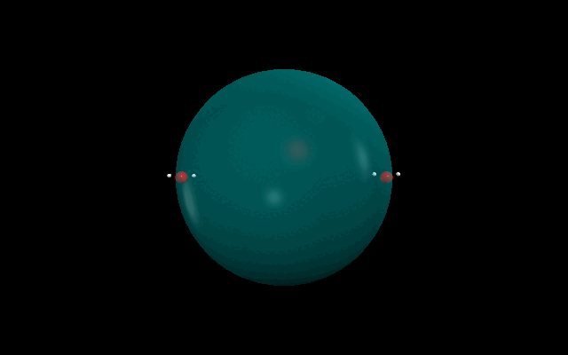

## Unbiased Reaction Path Search Algorithm (URPSA)
## How to install 

```bash 
https://github.com/WMCSameeraGroup/URPSA.git
```
Use the command or download the file and extract the folder.

## How to Run 
To run the program you need to specify the path of the configuration file to the repeated.py python script.

the following command can be used to run the program
```bash
python3 "/<path-to-URPSA-directory>/repeated.py" exampleInput.txt
```

## Input change
we have written a simple parser file for the organization of input parameters to the program.
The sections are *[SECTION]* defined with square brackets. 
predefined variables are placed on the left hand side and the values are defined by  

```buildoutcfg
[section]
variable = value
```
modify the input file to enter the inputs (*Molecules*, step_size, step_count, and etc )

- **update_with_optimized_coordinates**: keep the optimized configuration of molecules to the next method.
- **step size:** distance moved towards the center 
- **step_count:** number of steps should move towards the center
- **stop_distance_factor:** the factor that determines distance that the calculation should stop ; factor x (sum of covalent radius)
- **stress_release:** iterations that should be optimized without constraints. input is given as  start: step :end
- **spherical_placement:** how to place the molecular fragments on the hypothetical spherical.
- **ADD_COM_CONST:** whether to add center of mass constraints
- **dynamic_fragment_replacement:** if atoms are closer than given number value.


```buildoutcfg
# This is a comment
[project]
project_name = test48927

[controls]
# set this as false for now
update_with_optimized_coordinates = True
# in angstrum 
step_size = 0.1
step_count = 40
stop_distance_factor = 0.4
# stress_release = start: step :end 
stress_release = -1:50:57


# Total_random or statistically_even or False
spherical_placement = statistically_even

# add COM constraints = True
ADD_COM_CONST = False
dynamic_fragment_replacement = True

[gaussian]
number_of_cores = 8
memory = 8GB
#method = #N b3lyp/3-21g opt=AddGIC  nosymm
method =#N opt(maxcycle=600,AddGIC) PM6 scf(maxcyc=600,xqc) nosymm
#method =#N opt(maxcycle=100,AddGIC) HF/3-21g* scf(maxcyc=120,xqc) nosymm
# use dft


[molecules]
charge = 0
multiplicity = 2
number_of_molecules = 2

0 = C -0.69272980 -0.81618654 0.00000000\
H -0.33605696 -0.31178835 0.87365150\
H -0.33605696 -0.31178835 -0.87365150\
H -1.76272980 -0.81617336 0.00000000\
O -0.21607949 -2.16440926 0.00000000\
H -0.53442410 -2.61684869 0.78457331

# add \ to the end of a line if the next line continues
1 = O -0.21607949 -2.16440926 0.00000000\
H -0.53442410 -2.61684869 0.7845733

[Additional]
# use /- instead of = sign when using inside values

constraints = XCm1 (Inactive) /- XCntr(1-6) \
YCm1 (Inactive) /- YCntr(1-6) \
ZCm1 (Inactive) /- ZCntr(1-6)\
XCm2 (Inactive)  /- XCntr(7)\
YCm2 (Inactive)  /- YCntr(7) \
ZCm2 (Inactive) /- ZCntr(7)\
F1F2(FREEZE) /- sqrt[(XCm1-XCm2)^2+(YCm1-YCm2)^2+(ZCm1-ZCm2)^2]*0.529177

```


## output data
project outputs are saved in a directory inside the pwd

## defaults values 
the default values are stored as a dictionary 

```python

defaults = {
    "project": {
        "project_name": "test1",
        "input_file_name": "Test"
    },
    "controls": {
        "update_with_optimized_coordinates": "True",
        "step_size": 0.1,
        "step_count": 40,
        "stop_distance_factor": 0.4,
        "stress_release": "0:10:40",
        "sphere_radius": 4,
        "n_iterations": 100,
        "spherical_placement": "statistically_even",
        "ADD_COM_CONST": "False"
    },
    "gaussian": {
        "number_of_cores": 8,
        "memory": "8GB",
        "method": "#N opt(maxcycle=600,AddGIC) PM6 scf(maxcyc=600,xqc) nosymm"
    }
}

```

## output format 


each reaction path is saved with a folder named as test_00001 and gaussian calculations files(input file, output files) are stored. 
further a scattor plot of the energy of converged structures as scattor.jpg and a xyz file is produced to see the trajectory. 


## Method overview

This program initializes the molecular fragments on a hypothetical spherical surface at random positions which is specified by the input file.
and the orientation of the molecular fragments are also randomly changed to ensure all the possible starting positions are sampled,


Then the radius of the is reduced step by step according to the step given in the input file. for each step calculations are made made until either the number of steps(*step_count*) are over or atom are too close than the specified limit.


After the path was terminated by an exit condition. A randomly chosen new orientation is used to start the new reaction path. 
Likewise the number of reaction paths are found starting with different orientations until the number of iterations(*n_iterations*) are over as given in the input file.  


